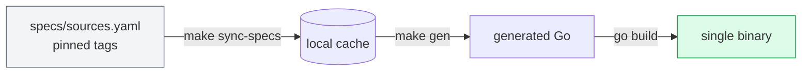

# lathe

> Turn any API spec into a polished CLI.

[](https://github.com/samzong/lathe/actions/workflows/ci.yml)
[](LICENSE)

Feed lathe a Swagger / OpenAPI 2.0 document or a `.proto` file with `google.api.http` annotations, and it gives you back a single `cobra` binary with per-operation subcommands, hostname-keyed auth, flag-driven request bodies, and table / JSON / YAML output — no hand-written command code.

> Status: v0.x, pre-release. The shape is stable. Details may still shift before v0.1.

---

## Why

Every service with a published API ends up wanting a CLI. Teams routinely burn weeks writing commands that mirror an existing Swagger or protobuf spec 1:1 — a duplication that silently rots the moment the spec evolves.

If the spec is the source of truth, the CLI should be derived from it, not transcribed.

lathe treats the spec as input and the CLI as output. Your job shrinks to:

- pin the upstream spec at a tag,
- declare a few identity fields (CLI name, auth endpoint),
- optionally overlay help text where the spec's wording is weak.

lathe handles everything else.

---

## Features

- **Two native backends** — Swagger 2.0 and `.proto` (with `google.api.http`). Each spec consumed in its real form; no cross-transcoding.
- **Hostname-keyed auth**, modeled on `gh` — per-host credentials, no ambient "current context". Select with `--hostname`, `$<NAME>_HOST`, or auto-select when only one host exists.
- **Body builder** — `--file -` for stdin JSON, `--set spec.replicas=3` for inline dotted-path patches.
- **Output formats** — `-o table|json|yaml|raw`. Table mode auto-selects columns from the response shape.
- **Overlay layer** — polish help text and aliases per-module without editing generated code.
- **Reproducible** — every upstream spec pinned at an immutable tag; floating branches rejected by design.

---

## How it works



Two commands drive the loop. Neither runs at `go build` time — downstream binaries have no codegen dependency at install.

---

## Quick start

Click **"Use this template"** on [github.com/samzong/lathe](https://github.com/samzong/lathe), then populate two files and run `make`.

### `cli.yaml` — CLI identity

```yaml
cli:
  name: acmectl
  short: "Command-line tool for Acme services"

auth:
  validate:
    method: GET
    path: /api/v1/whoami
    display:
      username_field: data.username
      fallback_field: data.email
```

### `specs/sources.yaml` — pin upstream specs

```yaml
sources:
  iam:
    repo_url: https://github.com/acme/iam.git
    pinned_tag: v1.4.0
    backend: swagger
    swagger:
      files:
        - api/openapi/user.swagger.json

  billing:
    repo_url: https://github.com/acme/billing.git
    pinned_tag: v0.9.2
    backend: proto
    proto:
      staging:
        - from: api/proto
          to: "."
      entries:
        - v1/accounts.proto
```

### Build

```sh
make bootstrap          # sync-specs + gen
go build -o bin/acmectl ./cmd/acmectl

./bin/acmectl auth login --hostname acme.example.com
./bin/acmectl iam create-user --email alice@example.com --role viewer
```

Re-run `make bootstrap` whenever you bump a `pinned_tag`.

---

## Sources reference

`specs/sources.yaml` declares which upstream specs become modules in your CLI.

| Field | Required | Notes |
|---|---|---|
| `repo_url` | ✓ | Any URL `git clone` accepts |
| `pinned_tag` | ✓ | Floating branches rejected — reproducibility is mandatory |
| `backend` | ✓ | `swagger` or `proto` (exclusive) |
| `swagger.files` | swagger only | Multiple files merge; duplicates warn, first-seen wins |
| `proto.staging` | proto only | Stage files into a protoc include root |
| `proto.entries` | proto only | Only RPCs with `google.api.http` become commands |

Grouping into subcommand trees:

- **Swagger** — uses the operation's first `tag`.
- **Proto** — uses the `service` name.

---

## Overlay layer

Where a spec's `summary` / `description` is weak, overlay files polish it without touching generated code.

```yaml
# internal/overlay/iam.yaml
commands:
  create-user:
    aliases: [adduser]
    short: "Create a user in the IAM service"
    example: |
      acmectl iam create-user \
        --email alice@example.com \
        --role viewer
```

Overlays are embedded into the binary at build time. Empty file = pass-through.

---

## Configuration

| Env var | Effect |
|---|---|
| `$<NAME>_HOST` | Select host without editing `hosts.yml` |
| `$<NAME>_CONFIG_DIR` | Override config dir (default `~/.config/<name>`) |
| `LATHE_SPECS_CACHE` | Where `make sync-specs` stages specs (default `.cache`) |

`<NAME>` is the uppercased `cli.name`.

---

## Design principles

1. **Spec is truth. Code is derived.** Before hand-writing a command, ask why the spec doesn't already say it.
2. **Mechanical first, overlay second.** Layer 1 is a verbatim mapping; polish only where reality beats the spec.
3. **No hidden state.** Hosts keyed by hostname. No ambient "current context", no implicit default.
4. **Two backends, one IR.** The runtime does not know whether a command came from Swagger or proto.

---

## Contributing

See [CONTRIBUTING.md](CONTRIBUTING.md). All commits must be signed off (`git commit -s`) per [DCO](https://developercertificate.org/).

## Security

See [SECURITY.md](SECURITY.md) for private vulnerability disclosure.

## License

[MIT](LICENSE) © samzong
