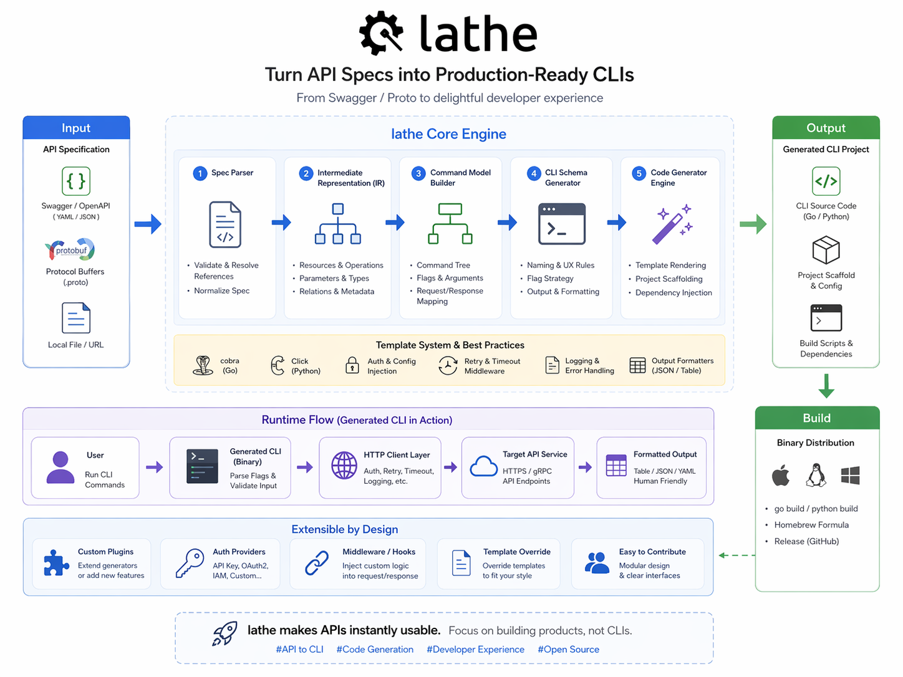

[English](README.md) | **中文**

# lathe

> 把任意 API 规格文件变成一个开箱即用的 CLI。

[](https://github.com/samzong/lathe/actions/workflows/ci.yml)
[](LICENSE)

给 lathe 喂一份 Swagger 2.0、OpenAPI 3 或带 `google.api.http` 注解的 `.proto` 文件，它就能生成一个完整的 `cobra` 二进制：按操作拆分子命令、按主机名管理认证、用 flag 构造请求体、支持 table / JSON / YAML 输出——不用手写任何命令代码。



---

## 为什么做

每个有公开 API 的服务最终都会需要一个 CLI。团队反复花几周时间把现有的 Swagger 或 protobuf 规格 1:1 翻写成命令——这种重复劳动在规格一更新就悄悄腐烂。

如果规格就是事实来源，CLI 就应该从它派生，而不是靠人工抄写。

lathe 把规格当输入，把 CLI 当输出。你只需要：

- 把上游规格锁定在一个 tag，
- 声明几个身份字段（CLI 名称、认证端点），
- 可选地用 overlay 润色规格描述不够好的地方。

剩下的交给 lathe。

---

## 特性

- **三种原生后端** — Swagger 2.0、OpenAPI 3 和 `.proto`（带 `google.api.http`）。每种规格以原始格式消费，无需交叉转码。
- **可复现** — 每个上游规格锁定在不可变 tag；浮动分支会被拒绝。Commit SHA 会记录并校验。
- **按主机名认证** — 借鉴 `gh` 的模型，按主机存储凭据。公开端点自动跳过认证；需要授权的端点会显示所需的 OAuth scope。
- **功能丰富的 CLI** — body builder（`--file`、`--set`）、`-o table|json|yaml|raw`、枚举校验、基于游标的分页（`--all`）、SSE 流式传输、参数默认值和废弃警告。
- **Overlay 层** — 按模块润色帮助文本、别名和示例，无需修改生成代码。
- **可扩展** — `Authenticator` 和 `Formatter` 接口，支持自定义认证方案和输出格式。
- **生产就绪** — 带稳定退出码（0–4）的类型化错误模型、`--debug` HTTP 追踪、生成代码与运行时之间的 schema 版本契约。

---

## 快速开始

在 [github.com/samzong/lathe](https://github.com/samzong/lathe) 点击 **"Use this template"**，然后填写两个文件，运行 `make`。

### `cli.yaml` — CLI 身份

```yaml
cli:
  name: acmectl
  short: "Command-line tool for Acme services"

auth:
  validate:
    method: GET
    path: /api/v1/whoami
    display:
      username_field: data.username
      fallback_field: data.email
```

### `specs/sources.yaml` — 锁定上游规格

```yaml
sources:
  iam:
    repo_url: https://github.com/acme/iam.git
    pinned_tag: v1.4.0
    backend: swagger
    swagger:
      files:
        - api/openapi/user.swagger.json

  billing:
    repo_url: https://github.com/acme/billing.git
    pinned_tag: v0.9.2
    backend: proto
    proto:
      staging:
        - from: api/proto
          to: "."
      entries:
        - v1/accounts.proto

  payments:
    repo_url: https://github.com/acme/payments.git
    pinned_tag: v2.1.0
    backend: openapi3
    openapi3:
      files:
        - api/openapi.yaml
```

### `internal/overlay/<module>.yaml` — 润色帮助文本（可选）

```yaml
# internal/overlay/iam.yaml
commands:
  create-user:
    short: "Create a user in the IAM service"
    aliases: [adduser]
    example: |
      acmectl iam create-user \
        --email alice@example.com \
        --role viewer
    params:
      role:
        help: "User role (viewer, editor, admin)"
        default: viewer
```

Overlay 在代码生成阶段烘焙进生成代码——运行时完全不感知它的存在。给 codegen 传 `-overlay internal/overlay` 即可。

### 构建

```sh
make bootstrap          # sync-specs + gen
go build -o bin/acmectl ./cmd/acmectl

./bin/acmectl auth login --hostname acme.example.com
./bin/acmectl iam create-user --email alice@example.com --role viewer
```

每次升级 `pinned_tag` 后重新运行 `make bootstrap`。

---

## Sources 参考

`specs/sources.yaml` 声明哪些上游规格会成为 CLI 中的模块。

| 字段 | 必填 | 说明 |
|---|---|---|
| `repo_url` | ✓ | `git clone` 能接受的任意 URL |
| `pinned_tag` | ✓ | 不接受浮动分支——可复现性是硬性要求 |
| `backend` | ✓ | `swagger`、`openapi3` 或 `proto`（互斥） |
| `swagger.files` | 仅 swagger | 多文件合并；重复时警告，先到先得 |
| `openapi3.files` | 仅 openapi3 | JSON 或 YAML；多文件合并；`$ref` 在文件内解析 |
| `proto.staging` | 仅 proto | 将文件暂存到 protoc 的 include 根目录 |
| `proto.entries` | 仅 proto | 只有带 `google.api.http` 的 RPC 才会变成命令 |

子命令树分组规则：

- **Swagger / OpenAPI 3** — 使用操作的第一个 `tag`。
- **Proto** — 使用 `service` 名称。

---

## 配置

| 环境变量 | 效果 |
|---|---|
| `$<NAME>_HOST` | 不编辑 `hosts.yml` 直接选择主机 |
| `$<NAME>_CONFIG_DIR` | 覆盖配置目录（默认 `~/.config/<name>`） |
| `LATHE_SPECS_CACHE` | `make sync-specs` 暂存规格的位置（默认 `.cache`） |

`<NAME>` 是 `cli.name` 的大写形式。

### 全局 flag

| Flag | 效果 |
|---|---|
| `--hostname` | 为本次调用选择主机 |
| `-o, --output` | 输出格式：`table\|json\|yaml\|raw` |
| `--insecure` | 跳过 TLS 证书验证 |
| `--debug` | 将 HTTP 请求/响应打印到 stderr |

---

## 设计原则

1. **规格即真相，代码即派生。** 在手写命令之前，先问为什么规格里没有。
2. **机械映射优先，overlay 其次。** 第一层是逐字映射；只在现实超越规格时才润色。
3. **无隐藏状态。** 主机按主机名索引。没有隐式的"当前上下文"，没有默认选中。
4. **多后端，一个 IR。** 运行时不知道一个命令来自 Swagger、OpenAPI 3 还是 proto。

---

## 参与贡献

参见 [CONTRIBUTING.md](CONTRIBUTING.md)。所有 commit 必须签署（`git commit -s`），遵循 [DCO](https://developercertificate.org/)。

## 安全

参见 [SECURITY.md](SECURITY.md) 了解私密漏洞披露流程。

## 许可证

[MIT](LICENSE) © samzong
