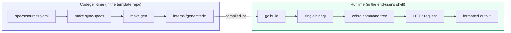
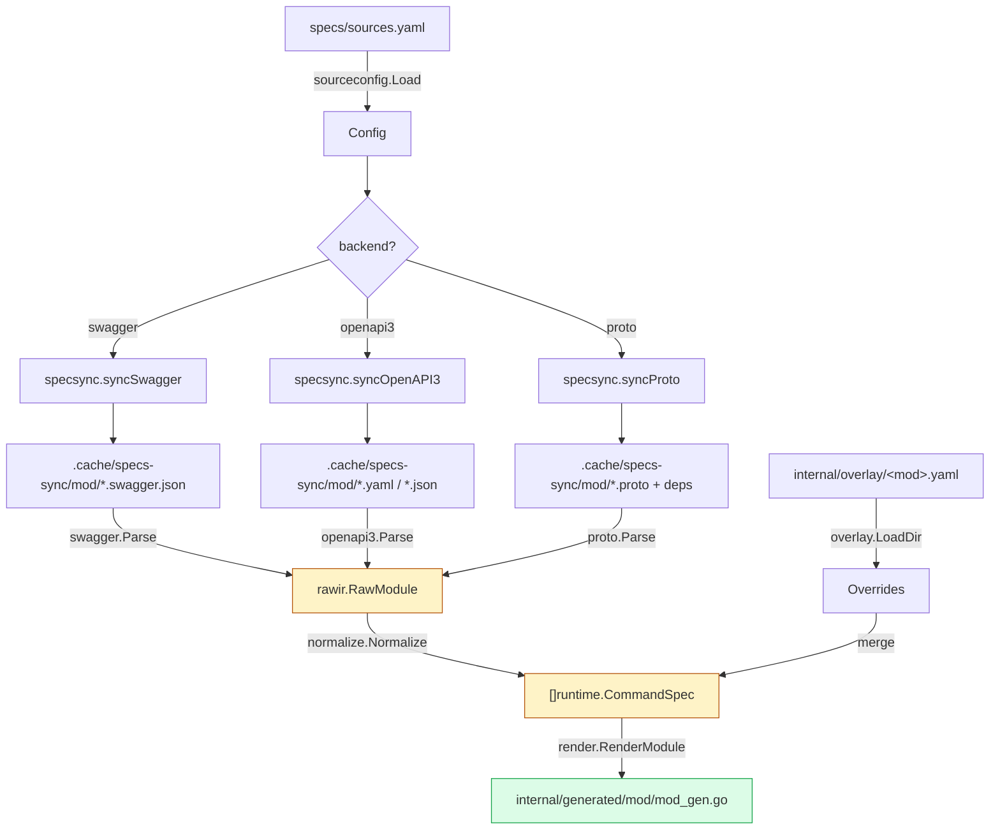
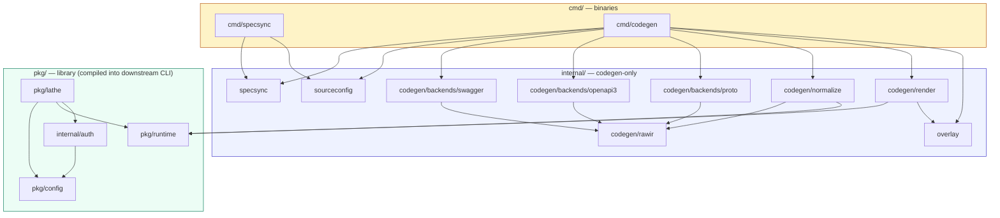
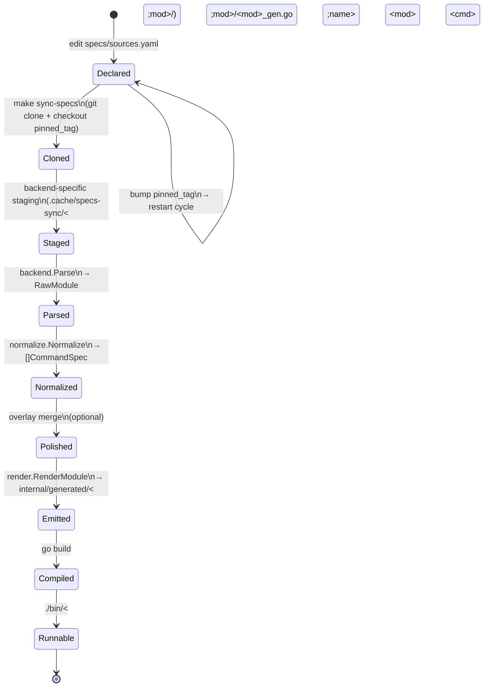
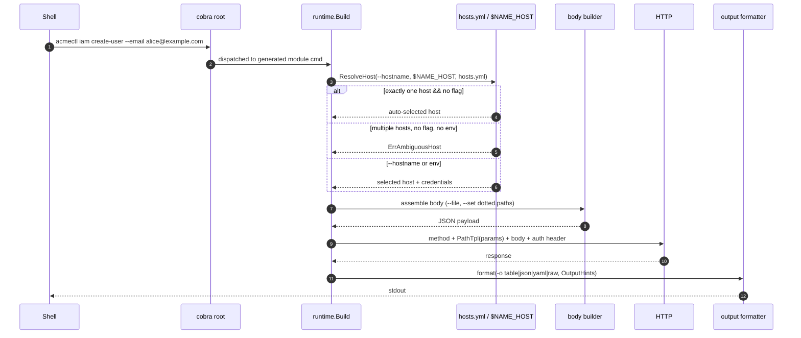

# Architecture

How lathe turns an API spec into a CLI, the packages involved, and the contracts between them. For user-facing usage, see [../README.md](../README.md).

## Prime idea

> The spec is input. The CLI is output. Humans curate the edges; code fills the middle.

## Two-phase model

lathe has two disjoint phases. They share types (`runtime.CommandSpec`) but run at different times and in different binaries.

The seam is `internal/generated/<module>/<module>_gen.go` — a `[]runtime.CommandSpec` literal per module. Everything above the seam is a build concern; everything below is a user concern.

## Codegen pipeline

Three backends fan in to a single raw IR (`rawir.RawModule`). `normalize` projects it onto `CommandSpec`. `render` is a pure template emit.

### Raw IR vs runtime spec

Two IRs exist on purpose. `rawir` preserves backend-adjacent detail (schemas, refs, per-response shape) needed for normalization decisions (list-path detection, column picking). `runtime.CommandSpec` is the minimal declarative form the runner needs. The boundary is enforced by the package graph: nothing under `pkg/runtime` imports `internal/codegen/**`.

### Why three backends, one IR

| Concern | Swagger backend | OpenAPI 3 backend | Proto backend |
|---|---|---|---|
| Grouping | operation's first `tag` | operation's first `tag` | `service` name |
| Operation ID | `operationId` | `operationId` | `rpc` name |
| Path / method | operation object | operation object | `google.api.http` annotation |
| Body schema | `requestBody` | `requestBody` (with `$ref` rewrite) | input message |
| Response schema | first 2xx response | first 2xx response | output message |

All normalized into the same `RawOperation` fields. By the time a spec reaches `normalize.Normalize`, the origin is irrelevant.

## Package layout

### Responsibilities

| Package | Phase | Responsibility |
|---|---|---|
| `cmd/specsync` | codegen | Thin wrapper over `internal/specsync`. Resolves cache root, runs sync. |
| `cmd/codegen` | codegen | Orchestrates: load sources → verify sync state → parse → normalize → render. |
| `internal/sourceconfig` | codegen | Parse `specs/sources.yaml`. Requires `pinned_tag`; treats the value as an immutable ref. |
| `internal/specsync` | codegen | `git clone --filter=blob:none`, checkout pinned ref, stage relevant files into `.cache/specs-sync/<module>/`. Writes `sync-state.yaml` (including `resolved_sha`). |
| `internal/codegen/backends/swagger` | codegen | Parse `*.swagger.json` → `RawModule`. Merges multiple files; first-seen wins on duplicates. |
| `internal/codegen/backends/openapi3` | codegen | Parse OpenAPI 3.x YAML/JSON → `RawModule`. Rewrites `$ref`; inherits path-level parameters. |
| `internal/codegen/backends/proto` | codegen | Parse staged `.proto` tree → `RawModule`. Only RPCs with `google.api.http` become operations. |
| `internal/codegen/rawir` | codegen | Backend-agnostic raw types (`RawModule`, `RawOperation`, `RawSchema`). Includes `$ref` resolution. |
| `internal/codegen/normalize` | codegen | Semantic projection: groups, `Short`, list path, default columns, method-ordering for determinism. |
| `internal/codegen/render` | codegen | `text/template` → gofmt'd Go. Emits per-module `_gen.go` and top-level `modules_gen.go`. |
| `internal/overlay` | codegen | Load `internal/overlay/<module>.yaml`. Baked into `CommandSpec` at codegen time. Runtime never sees overlays. |
| `internal/auth` | runtime | `auth login/logout/status`. Calls the configured validate endpoint. |
| `pkg/config` | runtime | `Manifest` (CLI identity) and `Hosts` (per-hostname credentials). `Bind(m)` seeds package-level helpers. |
| `pkg/runtime` | runtime | `CommandSpec` IR, `Build`, body builder, HTTP client with retry, `Authenticator` interface, `Formatter` registry, `LatheError`, schema version contract. |
| `pkg/lathe` | runtime | `NewApp(m)` — root cobra command with auth subtree and module groups. |

## Spec lifecycle

Each transition is idempotent and cache-checked. `specsync.VerifyState` rejects a stale cache where `sync-state.yaml` does not match `pinned_tag`.

## Overlay merge matrix

Overlays apply at codegen-time. The runtime has no overlay types. This matrix shows what each field's value source is and whether overlay can modify it.

### CommandSpec level

| IR field | Spec source | Overlay | Priority |
|---|---|---|---|
| `Use` | `operationId`-derived | rename | overlay > spec |
| `Group` | `tags[0]` / service name | override | overlay > spec |
| `Short` | `summary` / first comment | override | overlay > spec |
| `Long` | `description` / comment block | override | overlay > spec |
| `Aliases` | — | append | overlay-only |
| `Example` | — | set | overlay-only |
| `Method`, `PathTpl`, `HasBody` | spec | locked | spec-only |
| `OperationID` | `operationId` | — | spec-only |
| `Hidden` | `x-cli-hidden` | bool | overlay > spec |
| `Deprecated` | `deprecated` / proto option | bool + message | overlay > spec |
| `Security` | `security` / proto option | override (post-v0.1) | overlay > spec |
| `RequestBody.MediaType` | `consumes[0]` | override | overlay > spec |
| `Ignore` (command filter) | — | bool | overlay-only |

### ParamSpec level

| IR field | Spec source | Overlay | Priority |
|---|---|---|---|
| `Name` | spec | locked | spec-only |
| `Flag` | kebab-derived | rename | overlay > spec |
| `In` | spec | locked | spec-only |
| `GoType` | `type` / `format` | narrowing only (post-v0.1) | overlay > spec |
| `Help` | description / comment | override | overlay > spec |
| `Required` | `required` / path rule | relaxation only (post-v0.1) | overlay > spec |
| `Default` | spec or overlay | value | overlay > spec |
| `Enum`, `Format` | spec | override (post-v0.1) | overlay > spec |
| `Deprecated` | `param.deprecated` | bool | overlay > spec |

Two restricted-override rules: **`Required`** may only relax (required → optional), never tighten. **`GoType`** may only narrow (e.g. `string` → typed enum), never widen.

## Runtime request lifecycle

Three pieces of state cross the boundary:

1. **Manifest** (immutable, from `cli.yaml` embedded at build time) — CLI identity and auth shape.
2. **Hosts** (mutable, `~/.config/<name>/hosts.yml`) — per-hostname credentials. No "current host" stored.
3. **Flags** (transient) — `--hostname`, `--output`, `--insecure`, plus operation-specific flags.

## Extension points

| Extension | Built-in | Planned |
|---|---|---|
| Transport | Retry with exponential backoff, `Retry-After`, User-Agent. `WithTransport` injection. | Tracing, rate-limit middleware. |
| Authenticator | `Bearer` / `NoAuth`. Selectable per host via `ClientOptions.Auth`. | API key, mTLS, SigV4, OAuth-refresh. |
| Formatter | `table`, `json`, `yaml`, `raw`. `RegisterFormatter(name, f)`. | JMESPath, CSV, user templates. |
| Post-processor | Cursor-based pagination (`--all`, `--max-pages`), LRO polling (202 + Location). | Link header, offset-based pagination. |

Each extension is an injection point. The core works with a zero-config `CommandSpec`.

## Design invariants

These are structural, not stylistic. Violating any means the architecture breaks.

1. **`pkg/runtime` does not import `internal/codegen/**`.** The runtime cannot know how a `CommandSpec` was produced. This is what makes "three backends, one IR" real rather than aspirational.
2. **`pinned_tag` is required and validated.** `sourceconfig.Load` rejects empty values and floating refs (`HEAD`, `main`, `refs/heads/*`). Only immutable tags and 40-char SHAs are accepted. `specsync` records the resolved SHA and codegen verifies it.
3. **Codegen is never invoked at `go build` time.** Downstream consumers need no Go toolchain tags, build flags, or network access to install.
4. **Overlays bake at codegen-time.** The runtime has no overlay concept. This keeps `pkg/runtime` small and overlay bugs from being runtime bugs.
5. **No ambient "current host".** The host is a per-invocation input. This mirrors `gh` and avoids the "oops, wrong cluster" class of bug.
6. **`sync-state.yaml` guards the cache.** `make gen` refuses a cache that doesn't match `pinned_tag`. Stale generation fails loud, not silent.
7. **Static codegen.** Downstream binaries carry no spec parser. The generated file is a pure data literal.
8. **Single Go binary.** No `protoc`, `buf`, or other toolchain at install time. `go install` is the install path.

## Where to look next

- **Using the CLI** — [../README.md](../README.md)
- **Contributing** — [../CONTRIBUTING.md](../CONTRIBUTING.md)
- **Runtime IR** — [../pkg/runtime/spec.go](../pkg/runtime/spec.go)
- **Raw IR** — [../internal/codegen/rawir/types.go](../internal/codegen/rawir/types.go)
- **Example overlay** — [../examples/overlay/example.yaml](../examples/overlay/example.yaml)
