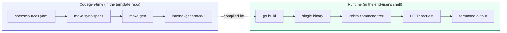
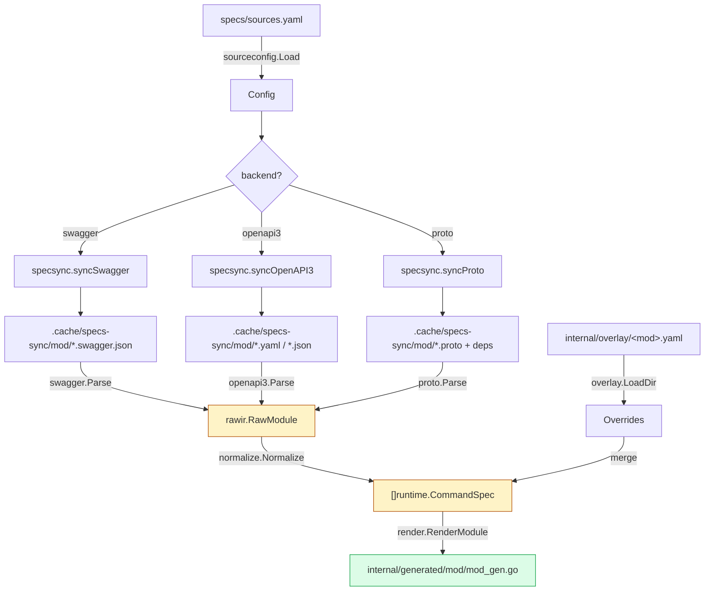
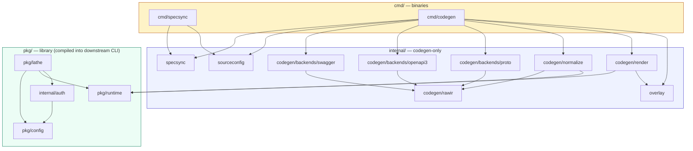
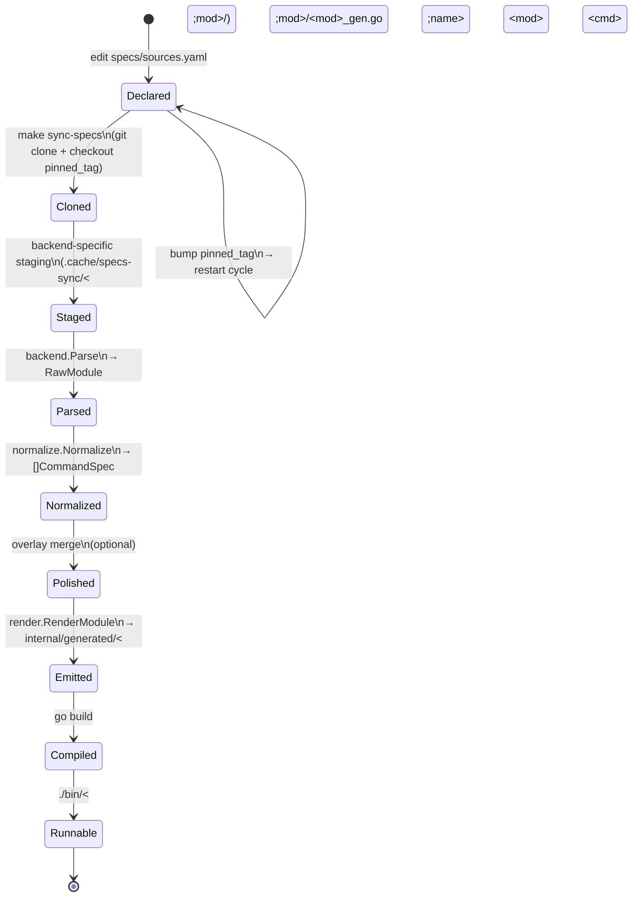
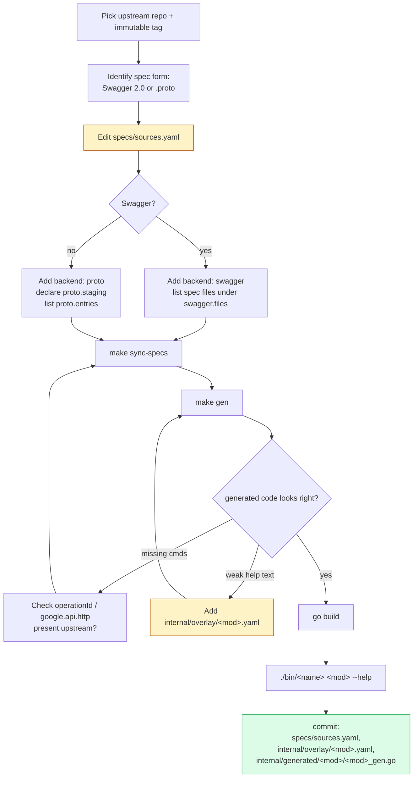
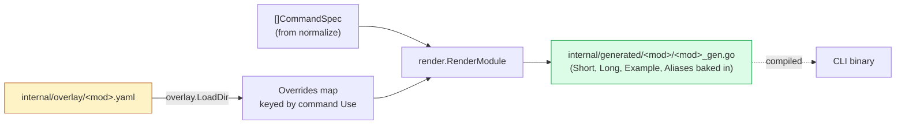
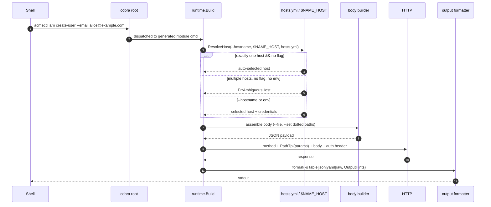

# Architecture

This document describes how lathe turns an API spec into a CLI, the packages involved, and the workflow for adding a new module. For user-facing usage, see [../README.md](../README.md).

## Prime idea

> The spec is input. The CLI is output. Humans curate the edges; code fills the middle.

Everything in lathe is organized around a single invariant: **spec is the source of truth, code is derived**. The consequences ripple through every package — no runtime awareness of the original backend, no hand-written commands for operations already described by the spec, no floating tags.

## Two-phase model

lathe has two disjoint phases. They share types (`runtime.CommandSpec`) but run at different times and in different binaries.



The seam between them is `internal/generated/<module>/<module>_gen.go` — a single file per module containing a `[]runtime.CommandSpec` literal. Everything above the seam is a build concern; everything below it is a user concern. The runtime has no idea whether a command came from Swagger or from proto.

## Codegen pipeline



Three backends fan in to a single raw IR (`rawir.RawModule`). `normalize` is the only place that understands the IR's semantics and projects it onto the runtime's `CommandSpec` shape. `render` is a pure `text/template` emit — if the `CommandSpec` shape is wrong, `render` cannot fix it.

### Raw IR vs runtime spec

Two IRs exist on purpose. `rawir` preserves backend-adjacent detail (schemas, refs, per-response shape) needed for **normalization decisions** (list-path detection, column picking). `runtime.CommandSpec` is the minimal declarative form the runner needs. The boundary between them is enforced by the package graph: nothing under `pkg/runtime` imports `internal/codegen/**`.

### Why three backends, one IR

| Concern | Swagger backend | OpenAPI 3 backend | Proto backend |
|---|---|---|---|
| Grouping | operation's first `tag` | operation's first `tag` | `service` name |
| Operation ID | `operationId` | `operationId` | `rpc` name |
| Path / method | operation object | operation object | `google.api.http` annotation |
| Body schema | `requestBody` | `requestBody` (with `$ref` rewrite) | input message |
| Response schema | first 2xx response | first 2xx response | output message |

All of the above are normalized into the same `RawOperation` fields. By the time a spec reaches `normalize.Normalize`, the origin is irrelevant.

## Package layout



### Responsibilities

| Package | Phase | Responsibility |
|---|---|---|
| `cmd/specsync` | codegen | Thin wrapper over `internal/specsync`. Resolves cache root, runs sync. |
| `cmd/codegen` | codegen | Orchestrates: load sources → verify sync state → parse → normalize → render. |
| `internal/sourceconfig` | codegen | Parse `specs/sources.yaml`. Requires `pinned_tag` to be set; treats the value as an immutable ref for reproducibility. |
| `internal/specsync` | codegen | `git clone --filter=blob:none` into `.cache/specs-work/<module>/`, then `git checkout` the pinned ref and stage the relevant files into `.cache/specs-sync/<module>/`. Writes `sync-state.yaml` (including `resolved_sha`) consumed by codegen to detect stale caches. |
| `internal/codegen/backends/swagger` | codegen | Parse `*.swagger.json` → `RawModule`. Merges multiple files; first-seen wins on duplicate operation IDs. |
| `internal/codegen/backends/openapi3` | codegen | Parse OpenAPI 3.x YAML/JSON → `RawModule`. Rewrites `#/components/schemas/` refs to rawir format; inherits path-level parameters. |
| `internal/codegen/backends/proto` | codegen | Parse staged `.proto` tree → `RawModule`. Only RPCs with a `google.api.http` binding become operations. |
| `internal/codegen/rawir` | codegen | Backend-agnostic raw types (`RawModule`, `RawOperation`, `RawSchema`). Includes `$ref` resolution. |
| `internal/codegen/normalize` | codegen | The semantic projection. Groups, picks `Short`, derives list path, picks default columns, enforces method-ordering for determinism. |
| `internal/codegen/render` | codegen | `text/template` → gofmt'd Go. Emits `internal/generated/<mod>/<mod>_gen.go` and the top-level `modules_gen.go` index. |
| `internal/overlay` | codegen | Load `internal/overlay/<module>.yaml`. Results are passed to `render.RenderModule`, baked into the emitted `CommandSpec` literal. Runtime never sees overlays. |
| `internal/auth` | runtime | `auth login/logout/status`. Uses `manifest.AuthInfo.Validate` to call the configured endpoint and display the identified principal. |
| `pkg/config` | runtime | `Manifest` (CLI identity) and `Hosts` (per-hostname credentials). `Bind(m)` seeds package-level helpers with the active manifest. |
| `pkg/runtime` | runtime | `CommandSpec` IR, the `Build` function that materializes cobra commands from specs, body builder (`--set`, `--file`), HTTP client with retry transport, `Authenticator` interface, `Formatter` registry, typed `LatheError` with stable exit codes, schema version contract. |
| `pkg/lathe` | runtime | `NewApp(m)` — returns the root cobra command with auth subtree and module groups attached. The downstream `main.go` is ~15 lines. |

## Spec lifecycle

From authoring a `sources.yaml` entry to a command the user can run:



Each transition is idempotent and cache-checked. `specsync.VerifyState` rejects a stale cache where the on-disk `sync-state.yaml` does not match the requested `pinned_tag`, so `make gen` alone never silently uses a drifted spec.

## Adding a new module

The canonical flow for adding an upstream API to your CLI:



The two manual surfaces are `specs/sources.yaml` (mandatory) and `internal/overlay/<mod>.yaml` (optional). Everything else is mechanical.

### Swagger vs proto at sync time

```mermaid
sequenceDiagram
    participant User
    participant Make as make sync-specs
    participant Git
    participant Swagger as swagger backend
    participant Proto as proto backend
    participant Cache as .cache/specs-sync/&lt;mod&gt;/

    User->>Make: invoke
    Make->>Git: clone --filter=blob:none + checkout pinned_tag
    Git-->>Make: .cache/specs-work/&lt;mod&gt;/

    alt backend: swagger
        Make->>Swagger: syncSwagger(src, workDir, syncDir)
        Swagger->>Cache: copy declared swagger.files verbatim
    else backend: proto
        Make->>Proto: syncProto(src, workDir, syncDir)
        Proto->>Cache: stage proto.staging layers
        Proto->>Cache: ensure proto.entries are resolvable
    end

    Make->>Cache: write sync-state.yaml\n(source, backend, synced_from)
```

Sync is a pure file-staging step. It never parses semantics. Parsing happens in `make gen`, which means a broken spec fails codegen, not sync — and the cache on disk is always a faithful copy of the upstream tag.

### Overlay bake

Overlays are a codegen-time concern only. They never reach runtime.



`Short`, `Long`, `Example` are replaced if non-empty. `Aliases` append (not replace), so overlay-added aliases sit alongside any the spec already implied. Runtime never reads overlay files; an empty or missing overlay dir is a pass-through.

## Runtime request lifecycle

What happens when a user runs `./bin/acmectl iam create-user --email alice@example.com`:



Three pieces of state cross the boundary:

1. **Manifest** (immutable, from `cli.yaml` embedded at build time) — defines the CLI's identity and auth shape.
2. **Hosts** (mutable, `~/.config/<name>/hosts.yml`) — per-hostname credentials. No "current host" is stored; the host is always resolved at invocation.
3. **Flags** (transient, per-invocation) — `--hostname`, `--output`, `--insecure`, plus operation-specific flags.

`config.Bind(m)` is called once in `main.go` so that `pkg/runtime` helpers can reach the active manifest without a parameter-passing chain.

## Design invariants

These are structural, not stylistic. Violating any of them means the architecture breaks.

1. **`pkg/runtime` does not import `internal/codegen/**`.** The runtime cannot know how a `CommandSpec` was produced. This is what makes "two backends, one IR" real rather than aspirational.
2. **`pinned_tag` is required and validated.** `sourceconfig.Load` rejects empty values and floating refs (`HEAD`, `main`, `refs/heads/*`). Only immutable tags and 40-char SHAs are accepted. `specsync` records the resolved commit SHA and codegen verifies it.
3. **Codegen is never invoked at `go build` time.** Downstream consumers of a lathe-generated CLI do not need Go toolchain tags, build flags, or network access to install it.
4. **Overlays bake at codegen-time.** The runtime has no overlay concept. This keeps `pkg/runtime` small and keeps overlay bugs from being runtime bugs.
5. **No ambient "current host".** The host is a per-invocation input. This mirrors `gh` and avoids the classic "oops, wrong cluster" class of bug.
6. **`sync-state.yaml` guards the cache.** `make gen` refuses a cache that doesn't match the requested `pinned_tag`. Stale generation fails loud, not silent.

## Where to look next

- **Using the CLI** — [../README.md](../README.md)
- **Contributing** — [../CONTRIBUTING.md](../CONTRIBUTING.md)
- **CLI identity shape** — [../pkg/config/manifest.go](../pkg/config/manifest.go)
- **Runtime IR** — [../pkg/runtime/spec.go](../pkg/runtime/spec.go)
- **Raw IR** — [../internal/codegen/rawir/types.go](../internal/codegen/rawir/types.go)
- **Example overlay** — [../examples/overlay/example.yaml](../examples/overlay/example.yaml)
