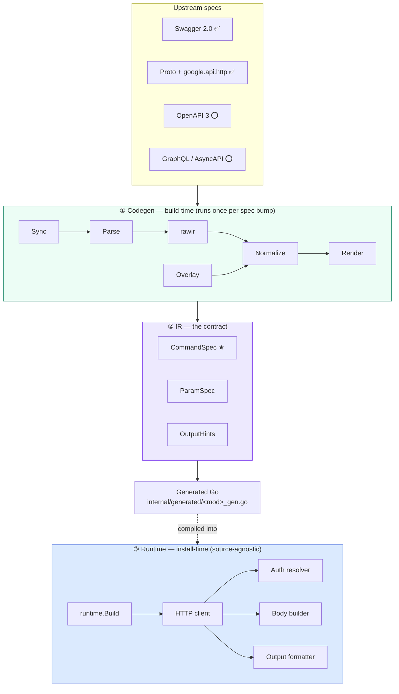

# Design

Complement to [architecture.md](architecture.md). Where `architecture.md`
describes the package layout, codegen pipeline, and runtime lifecycle,
this document is the **design specification**: the contracts each layer
exposes, the matrix that governs how overlays interact with the IR, and
the extension surfaces reserved for future work.

Status markers used throughout:

- **✅** delivered in `main`
- **🟡** delivered with known gaps
- **⭕** designed here, not yet implemented

---

## Core invariants

Five non-negotiable rules. A change that violates one is a mission-level
decision, not an implementation choice.

| # | Invariant | Current coverage |
|---|---|---|
| 1 | **Input surface**: the Swagger family and the Proto family. | `Swagger 2.0` + `OpenAPI 3` + `Proto` with `google.api.http`. |
| 2 | **Static codegen**. No `runtime-parse-spec`. | Enforced. Downstream binaries carry no spec parser. |
| 3 | **Single Go binary**. No `protoc`, `buf`, or other toolchain at install time. | Enforced. `go install` is the install path. |
| 4 | **Spec is truth; overlays apply at codegen-time**. The runtime has no awareness of overlays. | Enforced. `pkg/runtime` has no overlay types. |
| 5 | **Three backends, one IR**. All backends project into the same `runtime.CommandSpec`. Hostname-keyed auth. `pinned_tag` reproducibility. | IR kept clean. `pinned_tag` hardened with floating-ref rejection and `resolved_sha` verification. |

Anything that would require the runtime to distinguish backends, hold an
ambient "current host", or resolve specs at launch time is a design
regression. Reject it, or promote it to a mission-revision proposal.

---

## Three-layer model

Three disjoint concerns, three disjoint layers:

### ① Codegen layer

Runs on a developer's machine or in CI, not in the installed CLI.
Consumes a pinned spec, emits `[]CommandSpec` as Go source.

- **Spec sync** — clone upstream at `pinned_tag`, stage relevant files.
- **Parsers** — Swagger / Proto → backend-neutral `rawir.RawModule`.
- **Normalize** — rawir → `[]CommandSpec`. Semantic projection lives
  here and only here.
- **Overlay merge** — apply per-module `overlay/<mod>.yaml` on top.
- **Render** — `text/template` → formatted Go.

### ② IR layer — the contract

Three types in `pkg/runtime/spec.go` (`CommandSpec`, `ParamSpec`,
`OutputHints`) are the only contract between codegen and runtime. The
generated file is a pure data literal; the runtime consumes
`[]CommandSpec` with no knowledge of its provenance.

This is the architectural moat. "One runtime for multiple spec
families" is real only because every backend commits to the same IR. A
new backend that needs a field the IR does not have prompts a change in
one place, adopted by all backends. There is no per-backend escape
hatch.

### ③ Runtime layer

`runtime.Build(root, module, Specs)` mounts a module's commands onto
the cobra root. The runtime resolves hosts, assembles bodies, executes
HTTP requests, and formats responses. It is **source-agnostic**: given
the same `CommandSpec`, behavior is identical regardless of whether
Swagger or Proto produced it.

---

## IR contract

Fields marked ⭕ are reserved for a later release. No backend emits them
today, and runtime behavior is unchanged if they remain zero.

### CommandSpec

The declarative description of a single API operation.

**Delivered (16):**

| Field | Type | Purpose | Origin |
|---|---|---|---|
| `Group` | `string` | Top-level grouping in the module command tree. | Swagger/OAS3 `tags[0]` / Proto service name. |
| `Use` | `string` | Command name (kebab-case). | Derived from `operationId`. |
| `Aliases` | `[]string` | Additional command names. | Overlay-only. |
| `Short` | `string` | One-line help. | Swagger `summary` / first comment line. Overlay may override. |
| `Long` | `string` | Multi-line help. | Swagger `description` / comment block. Overlay may override. |
| `Example` | `string` | Usage sample for `--help`. | Overlay-only. |
| `OperationID` | `string` | Stable ID for overlay matching. | `operationId` / rpc name. |
| `Hidden` | `bool` | Exclude from `--help`. | Spec or overlay. |
| `Deprecated` | `string` | Deprecation message (cobra convention). | Spec or overlay. |
| `Method` | `string` | HTTP verb. | Spec (locked). |
| `PathTpl` | `string` | URL template with `{param}` placeholders. | Spec (locked). |
| `Params` | `[]ParamSpec` | Flag-mapped parameters. | See [ParamSpec](#paramspec). |
| `HasBody` | `bool` | Whether the operation accepts a body. | Spec (locked). |
| `BodyRequired` | `bool` | Whether the body is mandatory. | Spec (locked). |
| `RequestBody` | `*RequestBody` | Body metadata: `{ Required, MediaType }`. | Spec. |
| `Output` | `OutputHints` | Output-formatting hints. | See [OutputHints](#outputhints). |

**Roadmap (3):**

| Field | Type | Rationale | Target |
|---|---|---|---|
| `Since` | `string` | Minimum CLI version that supports this operation. | v0.1 |
| `Security` | `[]SecuritySpec` | Per-operation auth scope requirement. | v0.1 |
| `SchemaVersion` | `int` | ✅ Delivered. Runtime rejects mismatched generated files. | — |

### ParamSpec

How one API parameter maps to a CLI flag.

**Delivered (6):**

| Field | Type | Purpose | Notes |
|---|---|---|---|
| `Name` | `string` | API-side parameter name. | Spec (locked); API contract. |
| `Flag` | `string` | CLI flag name. | Kebab-derived from `Name`. |
| `In` | `string` | Parameter location. | `path`, `query`, `header`, `formData`. |
| `GoType` | `string` | Flag's Go type. | `string`, `int64`, `bool`, `[]string`. |
| `Help` | `string` | Flag help text. | From spec description. |
| `Required` | `bool` | Whether the flag is mandatory. | Spec; triggers `MarkFlagRequired`. |

**Roadmap (5):**

| Capability | Rationale | Target |
|---|---|---|
| `Default` | Overlay-supplied default value. | v0.1 |
| `Enum` | Enum validation and shell completion candidates. | v0.1 |
| `Format` | `date-time`, `email`, `uuid`, `int64`, etc. | v0.1 |
| `Deprecated` | Parameter-level deprecation warning. | v0.1 |
| `SchemaRef` | Enables `--print-sample` auto-generation. | v0.1 |

### OutputHints

**Delivered (2):**

| Field | Type | Purpose |
|---|---|---|
| `ListPath` | `string` | JSON path to the array in list responses. |
| `DefaultColumns` | `[]string` | Columns picked for `-o table`. Derived from scalar leaves + `PreferredColumns`. |

**Roadmap (3):**

| Capability | Rationale | Target |
|---|---|---|
| `Pagination` | Declare the pagination strategy (cursor / page_token / Link header) and field mapping. | v0.1 |
| `ResponseMediaType` | Replace the hard-coded `Accept: application/json` with per-operation types. | v0.1 |
| `Streaming` | Server-Sent Events, chunked responses, streaming RPCs. | v0.1 |

### Meta — overlay-only

Meta fields live in overlay YAML but are **not** part of the runtime
IR. They inform help text and docs rendering; runtime behavior does not
depend on them.

| Field | Purpose | Target |
|---|---|---|
| `examples[]` | Multiple worked examples for `--help`. | v0.2 |
| `docs_url` | External documentation link. | v0.3 |
| `tags` | Free-form grouping tags for docs. | v0.3 |

---

## Overlay merge matrix

Overlays apply at codegen-time. The runtime has no overlay types. This
matrix answers three questions:

1. Where does each IR field's value come from?
2. Can overlay modify it? (`yes` / `no` / `overlay-only`)
3. If both spec and overlay provide a value, which wins?

Legend:

- **spec** — value is derived from the upstream spec.
- **overlay** — overlay can override or augment a spec-provided value.
- **overlay-only** — spec has no equivalent concept; only overlay sets it.
- **locked** — hard fact; overlay must not set.

### CommandSpec level

| IR field | Spec source | Overlay | Priority |
|---|---|---|---|
| `Use` | `operationId`-derived | rename (v0.1) | overlay > spec |
| `Group` | `tags[0]` / service name | override (v0.2) | overlay > spec |
| `Short` | `summary` / first comment | override (**now**) | overlay > spec |
| `Long` | `description` / comment block | override (**now**) | overlay > spec |
| `Aliases` | — | append (**now**) | overlay-only |
| `Example` | — | set (**now**) | overlay-only |
| `Method`, `PathTpl`, `HasBody` | spec | locked | spec-only |
| `OperationID` | `operationId` (v0.1) | — | spec-only |
| `Hidden` | `x-cli-hidden` (v0.1) | bool (v0.1) | overlay > spec |
| `Deprecated` | `deprecated` / proto option | bool + message (v0.1) | overlay > spec |
| `Security` | `security` / proto option | scheme override (v0.2) | overlay > spec |
| `RequestBody.MediaType` | `consumes[0]` (v0.1) | override (v0.1) | overlay > spec |
| `Ignore` (command filter) | — | bool (v0.2) | overlay-only |

### ParamSpec level

| IR field | Spec source | Overlay | Priority |
|---|---|---|---|
| `Name` | spec | locked (API contract) | spec-only |
| `Flag` | kebab-derived | rename (v0.2) | overlay > spec |
| `In` | spec | locked (semantic fact) | spec-only |
| `GoType` | `type` / `format` | narrowing only (v0.3) | overlay > spec (restricted) |
| `Help` | description / comment | override (v0.2) | overlay > spec |
| `Required` | `required` / path-parameter rule | relaxation only (v0.3) | overlay > spec (restricted) |
| `Default` | — | value (v0.2) | overlay-only |
| `Enum`, `Format`, `Pattern` | spec | override / restrict (v0.2–0.3) | overlay > spec |
| `Deprecated` | `param.deprecated` | bool (v0.2) | overlay > spec |

### OutputHints level

| IR field | Spec source | Overlay | Priority |
|---|---|---|---|
| `ListPath` | response-schema heuristic | override (v0.2) | overlay > spec |
| `DefaultColumns` | scalar leaves + `PreferredColumns` | override (v0.2) | overlay > spec |
| `Pagination` | — | strategy + fields (v0.3) | overlay-only |
| `ResponseMediaType` | `produces[0]` (v0.3) | override (v0.3) | overlay > spec |
| `Streaming` | `produces` + `x-cli-stream` | override (v0.3) | overlay > spec |

### Restricted-override rules

Two overlay capabilities are intentionally one-directional:

- **`Required`**: overlay may **relax** (required → optional) but not
  tighten. Forcing a previously-optional parameter to be required would
  break callers of the underlying API whose spec says the parameter is
  optional.
- **`GoType`**: overlay may **narrow** (e.g. `string` → a typed enum
  wrapper) but not widen. Widening defeats spec-as-truth: the IR type
  becomes less strict than the spec claims.

---

## Runtime extension points

The runtime separates its surface into a **core** every lathe-generated
CLI includes and an **extension surface** for production-grade features
the core does not itself require.

### Delivered core

- `runtime.Build` — mount commands on a cobra root from `[]CommandSpec`.
- HTTP client (configurable TLS, timeout).
- Auth resolver (`hostname-keyed`, `gh`-style).
- Body builder (`--file`, `--set key.path=value`, stdin).
- Output formatter (`table`, `json`, `yaml`, `raw`).

### Extension roadmap

| Extension | Current state | Target |
|---|---|---|
| Transport middleware | ✅ `retryTransport` with exponential backoff, `Retry-After`, User-Agent injection. `WithTransport(http.RoundTripper)` injection point. | Tracing, rate-limit middleware. v0.2+. |
| Authenticator interface | ✅ `Authenticator` interface with `Bearer` / `NoAuth` built-in. Selectable per host via `ClientOptions.Auth`. | API key, Basic, mTLS, SigV4, OAuth-refresh implementations. v0.2+. |
| Formatter registry | ✅ `Formatter` interface + `RegisterFormatter(name, f)`. Built-in: table, json, yaml, raw. | JMESPath, CSV, user-supplied templates. v0.2+. |
| Response post-processor | Not yet implemented. | Pagination walking, long-running-operation polling, custom status handling (202 Location). v0.1. |

Each extension becomes an **injection point**, not a new dependency.
The core continues to work with a zero-config `CommandSpec`; generated
CLIs that need richer behavior register implementations at `main.go`
initialization.

---

## Delivery status

Coarse view. Per-task status lives with GitHub issues and the
`CONTRIBUTING.md` workflow.

| Area | State |
|---|---|
| Three-backend codegen / runtime separation | ✅ |
| Swagger + OpenAPI 3 + Proto backends feeding one IR | ✅ |
| Hostname-keyed auth | ✅ |
| Overlay merge (`Short`, `Long`, `Example`, `Aliases`) | ✅ |
| `pinned_tag` validation (floating ref rejection + `resolved_sha`) | ✅ |
| `CommandSpec` shape (15 fields incl. `OperationID`, `Hidden`, `Deprecated`, `RequestBody`) | ✅ |
| `ParamSpec` shape (6 fields; `In` supports `path\|query\|header\|formData`) | ✅ |
| `OutputHints` shape (2 / 5 fields) | 🟡 |
| Authenticator interface (`Bearer` / `NoAuth`) | ✅ |
| Transport middleware (retry with exponential backoff, User-Agent) | ✅ |
| Formatter registry (table / json / yaml / raw + custom registration) | ✅ |
| `SchemaVersion` contract | ✅ |
| Error model (`LatheError` + stable exit codes 0–4) | ✅ |
| Version command + `--debug` HTTP tracing | ✅ |
| goreleaser + release workflow | ✅ |
| CI (golangci-lint + vet + test) | ✅ |
| `ParamSpec` roadmap (`Default`, `Enum`, `Format`, `Deprecated`) | ⭕ |
| `OutputHints` roadmap (`Pagination`, `ResponseMediaType`, `Streaming`) | ⭕ |
| Overlay enhancements (flag rename, ignore, group override, param-level) | ⭕ |
| Response post-processor (pagination walking, polling, long-running ops) | ⭕ |

This section is kept intentionally coarse so it does not rot with every
merge. Version-grained commitments belong in release notes and issue
milestones, not in a design document.

---

## See also

- [architecture.md](architecture.md) — package layout, pipeline, runtime lifecycle
- [../README.md](../README.md) — user-facing usage
- [../CONTRIBUTING.md](../CONTRIBUTING.md) — contribution workflow
- [../pkg/runtime/spec.go](../pkg/runtime/spec.go) — the IR types in code
- [../internal/codegen/rawir/types.go](../internal/codegen/rawir/types.go) — raw IR reference
